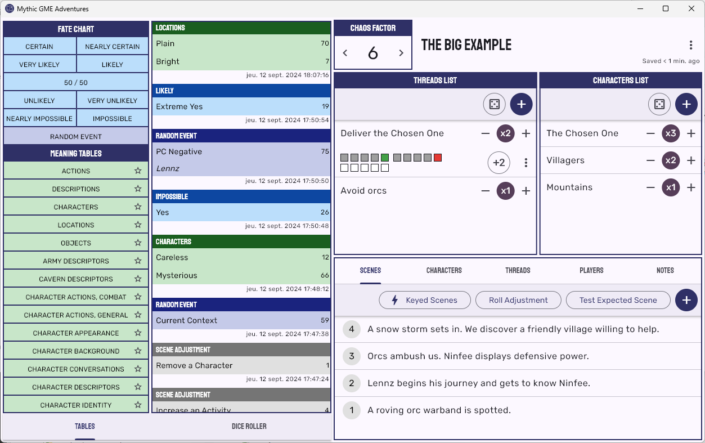

# Mythic GME Adventures

**Mythic GME Adventures** is an App for managing adventures using the rules of [Mythic Game Master Emulator, 2nd Edition](https://wordmillgames.com/mythic.html).

Features:
- Fate chart with Chaos variations (standard, mid, low, none)
- Meaning tables (from the book + user-created + translation support)
- Threads and Characters lists
- Thread progress track and Discovery questions
- Scenes with Adjustments
- Keyed Scenes
- Basic dice roller
- Save on Google Drive: you can share your adventures between your devices
- Works offline
- Export your adventure to a text file: you can format it properly in your text editor of choice
- Physical dice mode: switch to this mode to roll the dice yourself and lookup the result in the App

Available on [Windows](https://github.com/idispatch75/mythic-gme-adventures/releases), [Android](https://play.google.com/store/apps/details?id=idispatch.mythic_gme_adventures) and [Web](https://mythic-gme-adventures.idispatch.ovh).

The web version can be "installed" as an App on iOS and any desktop.  
Please refer to the [User Manual](https://idispatch75.github.io/mythic-gme-adventures/user_manual/#web-app) for browser compatibility.

See the [Home page](https://idispatch75.github.io/mythic-gme-adventures/) for more details.

[](docs/img/desktop.png)

## Build

### Windows

Install [Inno Setup](https://jrsoftware.org/isdl.php).

```bat
flutter build windows
"C:\Program Files (x86)\Inno Setup 6\ISCC.exe" windows\setup.iss
```
The setup is in `.\build\windows`.

### Android

1. Update the build number in `pubspec.yml` for a new release.
The build number will be used as `versionCode` in `android\app\build.gradle`.
[Android versioning](https://developer.android.com/studio/publish/versioning).
1. Build the App bundle.
	```
	flutter build appbundle
	```
	The bundle is `build/app/outputs/bundle/release/app-release.aab`.

### Web

Build the site.
```
flutter build web --base-href /<build_number>/
```
The result is in `build\web`.

The content must be deployed to the directory `/<build_number>/` except `index.html` and `auth.html` that must be deployed at the root:
```
/<build_number>
  icons
  manifest.json
  main.dart.js
  ...
/index.html
/auth.html
```
This is required to ensure having the browser load the latest version of the site while utilizing the offline caching of the PWA.  
See https://github.com/flutter/flutter/issues/127459#issuecomment-2378870433 for more info.  
Another option is to build with `--pwa-strategy none` to disable PWA caching completely (in this case `manifest.json` must be updated with `"start_url": "."`).

Deploy:
https://learn.microsoft.com/en-us/azure/static-web-apps/static-web-apps-cli-deploy
```
cd build\web
az login
az staticwebapp secrets list --name swa-mythic-gme-adventures --query "properties.apiKey"
swa deploy --env production --deployment-token TOKEN 
```

## Development

### Certificates

- Android:
	```
	keytool -genkey -v -keystore upload-keystore.jks -storetype JKS -keyalg RSA -keysize 2048 -validity 10000 -alias upload
	```

### Non versioned files

From Securesafe:
- download `android\upload-keystore.jks`
- download `android\key.properties`

### VS Code extensions

https://marketplace.visualstudio.com/items?itemName=Dart-Code.flutter

### Upgrade

https://docs.flutter.dev/release/upgrade

### Google Sign-in

https://developers.google.com/android/guides/client-auth

### Image converter

https://imagemagick.org/

```bat
rem Android
magick -background "#2f3066" -size 192x192 assets\ic_launcher.svg android\app\src\main\res\mipmap-xxxhdpi\ic_launcher.png
magick -background "#2f3066" -size 144x144 assets\ic_launcher.svg android\app\src\main\res\mipmap-xxhdpi\ic_launcher.png
magick -background "#2f3066" -size 96x96 assets\ic_launcher.svg android\app\src\main\res\mipmap-xhdpi\ic_launcher.png
magick -background "#2f3066" -size 72x72 assets\ic_launcher.svg android\app\src\main\res\mipmap-hdpi\ic_launcher.png
magick -background "#2f3066" -size 48x48 assets\ic_launcher.svg android\app\src\main\res\mipmap-mdpi\ic_launcher.png

magick -background none -size 108x108 assets\splash-android12-light.svg android\app\src\main\res\drawable\ic_launcher_foreground.png

magick -background none -size 500x500 assets\splash-light.svg assets\splash-light.png
magick -background none -size 500x500 assets\splash-dark.svg assets\splash-dark.png

magick -background "#2f3066" -size 512x512 assets\android-store.svg assets\android-store.png

rem Windows
magick -background none -size 16x16 assets\splash-light.svg %temp%\ic-16.png
magick -background none -size 20x20 assets\splash-light.svg %temp%\ic-20.png
magick -background none -size 24x24 assets\splash-light.svg %temp%\ic-24.png
magick -background none -size 30x30 assets\splash-light.svg %temp%\ic-30.png
magick -background none -size 32x32 assets\splash-light.svg %temp%\ic-32.png
magick -background none -size 36x36 assets\splash-light.svg %temp%\ic-36.png
magick -background none -size 40x40 assets\splash-light.svg %temp%\ic-40.png
magick -background none -size 48x48 assets\splash-light.svg %temp%\ic-48.png
magick -background none -size 60x60 assets\splash-light.svg %temp%\ic-60.png
magick -background none -size 64x64 assets\splash-light.svg %temp%\ic-64.png
magick -background none -size 72x72 assets\splash-light.svg %temp%\ic-72.png
magick -background none -size 80x80 assets\splash-light.svg %temp%\ic-80.png
magick -background none -size 96x96 assets\splash-light.svg %temp%\ic-96.png
magick -background none -size 256x256 assets\splash-light.svg %temp%\ic-256.png
magick %temp%\ic-*.png windows\runner\resources\app_icon.ico

rem web
rem https://learn.microsoft.com/en-us/microsoft-edge/progressive-web-apps-chromium/how-to/icon-theme-color
magick -background none -size 16x16 assets\splash-light_mini.svg web\favicon.png
magick -background none -size 16x16 assets\splash-light_mini.svg web\icons\icon-16.png
magick -background none -size 24x24 assets\splash-light_mini.svg web\icons\icon-24.png
magick -background none -size 32x32 assets\splash-light_mini.svg web\icons\icon-32.png
magick -background none -size 44x44 assets\splash-light_mini.svg web\icons\icon-44.png
magick -background none -size 48x48 assets\splash-light_mini.svg web\icons\icon-48.png
magick -background none -size 55x55 assets\splash-light_mini.svg web\icons\icon-55.png
magick -background none -size 71x71 assets\splash-light_mini.svg web\icons\icon-71.png
magick -background none -size 89x89 assets\splash-light_mini.svg web\icons\icon-89.png
magick -background none -size 150x150 assets\splash-light.svg web\icons\icon-150.png
magick -background none -size 188x188 assets\splash-light.svg web\icons\icon-188.png
magick -background none -size 192x192 assets\splash-light.svg web\icons\icon-192.png
magick -background none -size 256x256 assets\splash-light.svg web\icons\icon-256.png
magick -background none -size 310x310 assets\splash-light.svg web\icons\icon-310.png
magick -background none -size 388x388 assets\splash-light.svg web\icons\icon-388.png
magick -background none -size 512x512 assets\splash-light.svg web\icons\icon-512.png
```

### Platform-specific

- file_picker: https://github.com/miguelpruivo/flutter_file_picker/wiki/Setup
- flutter_secure_storage: https://pub.dev/packages/flutter_secure_storage
- Only one App instance on Desktop: https://stackoverflow.com/questions/67233239/run-only-single-instance-of-flutter-desktop-application

#### Android

- android SDK versions
	- in `android\app\build.gradle`
		```groovy
		defaultConfig {
			...
			minSdkVersion 21
			targetSdkVersion 34
		}
		```

- to avoid saving the secure storage:
	- in `android\app\src\main\AndroidManifest.xml` add to `activity`: `android:fullBackupContent="@xml/auto_backup_rules"` `android:dataExtractionRules="@xml/data_extraction_rules"`
	- add file `android\app\src\main\res\xml\auto_backup_rules.xml`
		```xml
		<?xml version="1.0" encoding="utf-8"?>
		<full-backup-content>
			<include domain="sharedpref" path="."/>
			<exclude domain="sharedpref" path="FlutterSecureStorage"/>
		</full-backup-content>
		```
	- add file `android\app\src\main\res\xml\data_extraction_rules.xml`
		```xml
		<?xml version="1.0" encoding="utf-8"?>
		<data-extraction-rules>
			<cloud-backup>
				<include domain="sharedpref" path="."/>
				<exclude domain="sharedpref" path="FlutterSecureStorage"/>
			</cloud-backup>
			<device-transfer>
				<include domain="sharedpref" path="."/>
				<exclude domain="sharedpref" path="FlutterSecureStorage"/>
			</device-transfer>
		</data-extraction-rules>
		```

- to enable signing
	- in `android\app\build.gradle`
		```groovy
		def keystoreProperties = new Properties()
		def keystorePropertiesFile = rootProject.file('key.properties')
		if (keystorePropertiesFile.exists()) {
				keystoreProperties.load(new FileInputStream(keystorePropertiesFile))
		}
		```
		```groovy
		android {
			...
			signingConfigs {
				release {
					keyAlias keystoreProperties['keyAlias']
					keyPassword keystoreProperties['keyPassword']
					storeFile keystoreProperties['storeFile'] ? file(keystoreProperties['storeFile']) : null
					storePassword keystoreProperties['storePassword']
				}
			}
			
			buildTypes {
				release {
					signingConfig signingConfigs.release
				}
			}
		}
		```

#### macOS

- intercept exit event, in `macos/Runner/AppDelegate.swift`:
	```swift
	override func applicationShouldTerminateAfterLastWindowClosed(_ sender: NSApplication) -> Bool {
		return false
  }
	```
