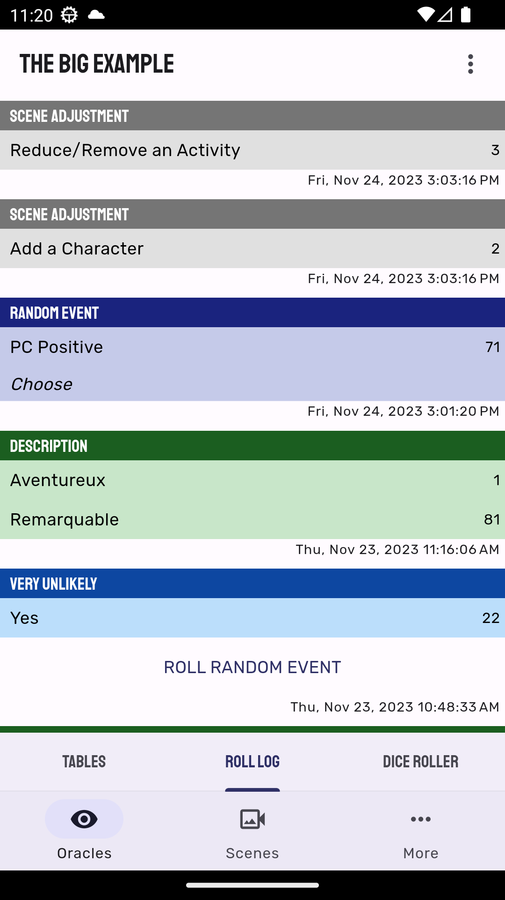

**Mythic GME Adventures** is an App for managing adventures using the rules of [Mythic Game Master Emulator, 2nd Edition](https://wordmillgames.com/mythic.html).

Features:
- Fate chart with Chaos variations (standard, mid, low, none)
- Meaning tables (from the book + user-created + translation support)
- Threads and Characters lists
- Thread progress track and Discovery questions
- Scenes with Adjustments
- Keyed scenes
- Basic dice roller
- Save on Google Drive: you can share your adventures between your devices
- Works offline
- Export your adventure to a text file: you can format it properly in your text editor of choice
- Physical dice mode: switch to this mode to roll the dice yourself and lookup the result in the App

Available on [Windows](https://github.com/idispatch75/mythic-gme-adventures/releases), [Android](https://play.google.com/store/apps/details?id=idispatch.mythic_gme_adventures) and <a href="https://mythic-gme-adventures.idispatch.ovh" target="_blank">Web</a>.  
The Web version can be used offline and is "installable" as an App on all platforms, including iOS. See the [User Manual](user_manual#web-app) for more info.

